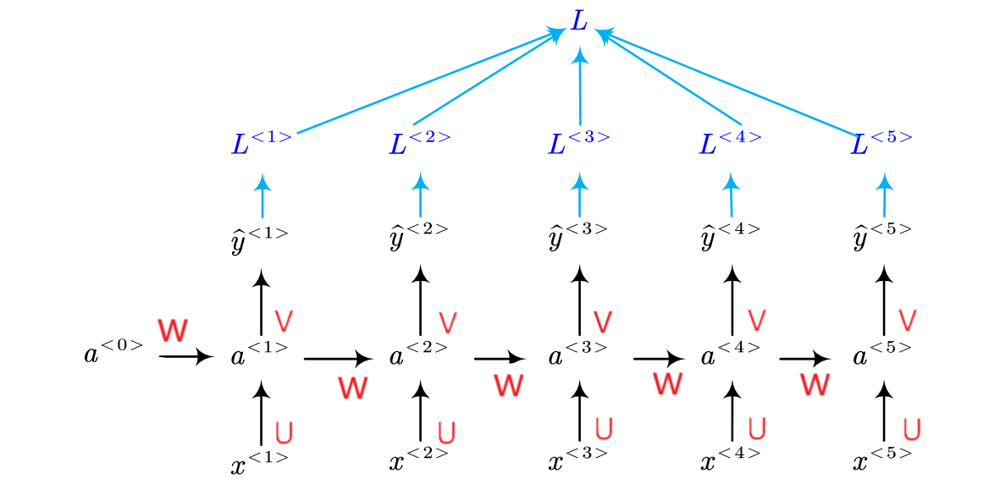
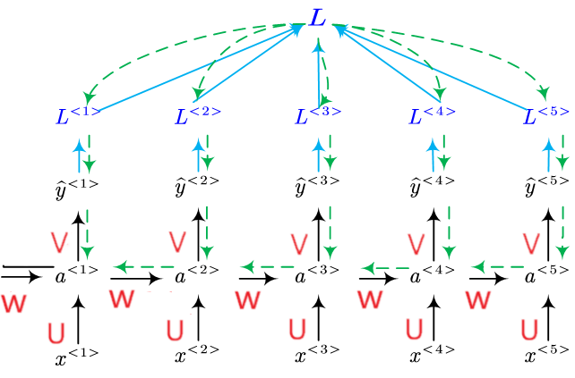

# CRNN: An End-to-End Trainable Neural Network for Image-based Sequence Recognition 
A PyTorch implementation of [Convolutional Recurrent Neural Network](https://arxiv.org/abs/1507.05717) for scene text recognition.
The author's original implementation can be found [here](https://github.com/bgshih/crnn).

A novel neural network architecture, which integrates feature extraction, sequence modeling and transcription into a unified framework, is proposed for image-based sequence recognition tasks, such as scene text recognition and OCR.

## Recurrent Neural Networks
### Sequential Data
Sequential data or time-series data is any kind of data where the order matters, one thing follows another. Sequential data comes in many forms such as audio, video, text, etc. To illustrate, say you take a screenshot of the video and then you want to predict the action of the person in that video. Hardly can you perform such task without knowledge of previous frames of the video. But if you take many screenshots of that person in succession, you may have enough information to make a prediction.

Another example, you can break text up into a sequence of words. Say "I am Vietnamese", if you shuffer the order, it will impact directly to the original meaning. The order of each word in the sequence is crucial to express the sentence's contents.

### Recurrent Neural Networks
In traditional neural networks, also known as feed-forward neural network, we assume that all inputs (and outputs) are independent of each other, information moves in only one direction, forward, from the input nodes, through the hidden nodes (if any) to the output nodes.

 

A feed-forward neural network are not able to use previous information to effect later ones. But Recurrent Neural Networks address this issue. They are networks with loops that carries information from one step to the next, allowing information to persist.

-  is the input at time step t.
-  is the hidden state at time step t.  is calculated based on the previous hidden state and the input at the current step: . The function f usually is a nonlinearity such as tanh or ReLU. The hidden state serve as memory container of the network. It capture information about what happened in the previous time steps. 
-  is the output at step t. The output at step  is calculated solely based on the memory at time t. 

Unlike a traditional deep neural network, which uses different parameters at each layer, a RNN shares the same parameters (U, V, W above) across all steps. This reflects the fact that we are performing the same task at each step, just with different inputs. This greatly reduces the total number of parameters we need to learn.

The pros and cons of a typical RNN architecture:
|Advantages|Drawbacks|
|---|---|
|- Possibility of processing input of any length|        - Computation being slow|
|- Model size not increasing with size of input |        - Difficulty of accessing information from a long time ago|
|- Computation takes into account historical information|- Cannot consider any future input for the current state|
|- Weights are shared across time||

### Different types of RNN

#### One to One
One to One RNN (==1) is the most basic and traditional type of Neural Network giving a single output for a single input where they are independent of previous information.

Ex: Image classification.

#### One to Many
One to Many (=1, >1) is a kind of RNN architecture is applied in situations that give multiple output for a single input.

Ex: Image captioning, Music generation.

#### Many to One
Many to One (>1, =1) is a kind of RNN architecture is applied in situations when multiple inputs are required for a single output.

Ex: Sentiment classification, Video regconition.

#### Many to Many
Many to Many is a kind of RNN architecture takes multiple input and gives multiple output.
- (!=): This is a kind of RNN architecture where input and output layers are of different size. Ex: Machine translation.
- (=): This is a kind of RNN architecture where input and output layers have the same size. In other words, every input having a output. Ex: Name entity recognition.

### The problem of Short-term Memory
In the training process, recurrent neral network does a forward pass and then compares the current output and the ground truth using the cross entropy error to estimate how poorly the network is performing. We typically treat the full sequence  as one sample, so the total error is the sum of the errors at each time step. The gradient is calculated for each time step with respect to the U, V and W weight parameter using the chain rule of differentiation. Going back to every time steps to update the weights starting from the error is called `Backpropogate through time`.

`Backpropogate through time` is not much different from the standard backpropagation algorithm. The key difference is that we sum up the gradients for W at each time step because the RNN architecture share the parameters across layers. Also note that we are taking the derivative of a vector function with respect to a vector, the result is a matrix (called the Jacobian matrix) whose elements are all the pointwise derivatives.

While you are using Backpropogating through time, we adjust our weight matrices with the use of a gradient. In the process, gradients are calculated by continuous multiplications of derivatives. The value of these derivatives may be so small that these continuous multiplications may cause the gradient to practically “vanish”.The earlier layers fail to learn anything as the internal weights are barely being adjusted due to extremely small gradient. And that’s the `vanishing gradient` problem.

Because of `vanishing gradient`, RNN’s not being able to learn on earlier time step. In other words, the network can forget what it seen in longer sequences, thus long-term dependencies being ignored during training.

On the other hand, when the derivatives  are large, we obtain an opposite effect called `exploding gradient`, which leads to instability in the network. The problem of exploding gradients can be solved by gradient clipping i.e. if gradient is larger than the threshold, scale it by dividing. 

### LSTM Network
`Long Short Term Memory` network – usually just called `LSTM` was created as the solution to short-term memory. All recurrent neural network have the form of a chain of repeating modules of neural network. In standard RNN, this repeating module will have a very simple structure, such as a single tanh layer. LSTM also has this chain like structure, but the repeating module has a different structure. Instead of having a single neural network layer, there are four, interacting in a very special way.

The memory cell state, the horizontal line running through the top of the diagram is the core idea behind `LSTM`. The cell state act as a transport highway that transfers relative information all the way down the sequence chain, reducing the effects of short-term memory. As the cell state goes on, information gets added or removed to the cell state via gates. The gates can learn which information is relevant to keep or forget during training.

#### Forget gate
The forget gate decides what information will be thrown away or kept.  Information from the previous hidden state and information from the current input is passed through the sigmoid function. Values come out between `0` and `1`. `1` represents completely keep the information and `0` represents completely get rid of  it.

#### Input gate
The input gate decides what new information we’re going to store in the cell state. We pass the previous hidden state and current input into a sigmoid function. That decides which values will be updated by transforming the values to be between `0` and `1`. `0` means not important at all, and `1` means important. We also pass the hidden state and current input into the tanh function to squish values between -1 and 1 to help regulate the network. Then we multiply the tanh output with the sigmoid output. The sigmoid output will decide which information is important to keep from the tanh output.

#### Cell state
The next step is update the old cell state  into the new cell state . First, the cell state gets pointwise multiplied by the forget vector. Then we take the output from the input gate and do a pointwise addition which updates the cell state to new values that the neural network finds relevant.

#### Output gate
The output gate decides which part of the cell state makes it to the output. First, we pass the previous hidden state and the current input into a sigmoid function. Then we pass the newly modified cell state to the tanh function. We multiply the tanh output with the sigmoid output to decide what information the hidden state should carry.

### bidirectional lstm

## CRNN Architecture

### Convolutional Layers

### Recurrent Layers

### Transcription Layers

## Reference
[Understanding LSTM Networks.](http://colah.github.io/posts/2015-08-Understanding-LSTMs/)
[Illustrated Guide to Recurrent Neural Networks.](https://towardsdatascience.com/illustrated-guide-to-recurrent-neural-networks-79e5eb8049c9)
