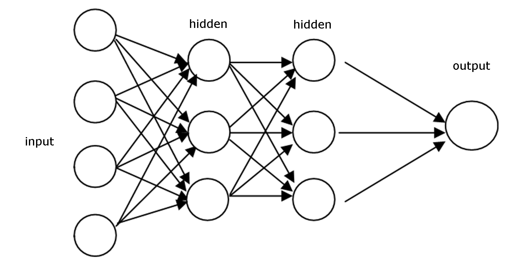
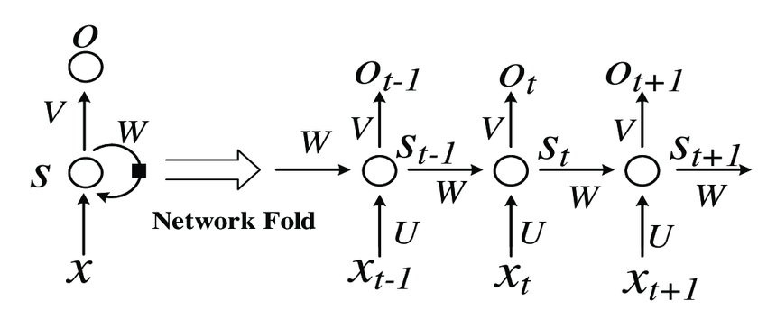

# CRNN: An End-to-End Trainable Neural Network for Image-based Sequence Recognition 
A PyTorch implementation of [Convolutional Recurrent Neural Network](https://arxiv.org/abs/1507.05717) for scene text recognition.
The author's original implementation can be found [here](https://github.com/bgshih/crnn).

A novel neural network architecture, which integrates feature extraction, sequence modeling and transcription into a unified framework, is proposed for image-based sequence recognition tasks, such as scene text recognition and OCR.

## Recurrent Neural Networks
### Sequential Data
Sequential data or time-series data is any kind of data where the order matters, one thing follows another. Sequential data comes in many forms such as audio, video, text, etc. To illustrate, say you take a screenshot of the video and then you want to predict the action of the person in that video. Hardly can you perform such task without knowledge of previous frames of the video. But if you take many screenshots of that person in succession, you may have enough information to make a prediction.

Another example, you can break text up into a sequence of words. Say "I am Vietnamese", if you shuffer the order, it will impact directly to the original meaning. The order of each word in the sequence is crucial to express the sentence's contents.

### Recurrent Neural Networks
In traditional neural networks, also known as feed-forward neural network, we assume that all inputs (and outputs) are independent of each other, information moves in only one direction, forward, from the input nodes, through the hidden nodes (if any) to the output nodes.

 

A feed-forward neural network are not able to use previous information to effect later ones. But Recurrent Neural Networks address this issue. They are networks with loops that carries information from one step to the next, allowing information to persist.

-  is the input at time step t.
-  is the hidden state at time step t.  is calculated based on the previous hidden state and the input at the current step: . The function f usually is a nonlinearity such as tanh or ReLU. The hidden state serve as memory container of the network. It capture information about what happened in the previous time steps. 
-  is the output at step t. The output at step  is calculated solely based on the memory at time t. 

Unlike a traditional deep neural network, which uses different parameters at each layer, a RNN shares the same parameters (U, V, W above) across all steps. This reflects the fact that we are performing the same task at each step, just with different inputs. This greatly reduces the total number of parameters we need to learn.

The pros and cons of a typical RNN architecture:
|Advantages|Drawbacks|
|---|---|
|- Possibility of processing input of any length|        - Computation being slow|
|- Model size not increasing with size of input |        - Difficulty of accessing information from a long time ago|
|- Computation takes into account historical information|- Cannot consider any future input for the current state|
|- Weights are shared across time||

### Different types of RNN

#### One to One
One to One RNN (==1) is the most basic and traditional type of Neural Network giving a single output for a single input where they are independent of previous information.

Ex: Image classification.

#### One to Many
One to Many (=1, >1) is a kind of RNN architecture is applied in situations that give multiple output for a single input.

Ex: Image captioning, Music generation.

#### Many to One
Many to One (>1, =1) is a kind of RNN architecture is applied in situations when multiple inputs are required for a single output.

Ex: Sentiment classification, Video regconition.

#### Many to Many
Many to Many is a kind of RNN architecture takes multiple input and gives multiple output.
- (!=): This is a kind of RNN architecture where input and output layers are of different size. Ex: Machine translation.
- (=): This is a kind of RNN architecture where input and output layers have the same size. In other words, every input having a output. Ex: Name entity recognition.

### The problem of Short-term Memory

### LSTM Network

