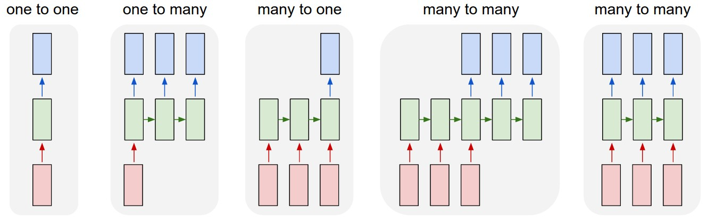
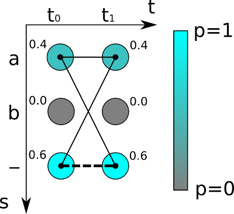

 A PyTorch implementation of [Convolutional Recurrent Neural Network](https://arxiv.org/abs/1507.05717), an End-to-End Trainable Neural Network for Image-based Sequence
Recognition and Its Application to Scene Text Recognition. The author's original implementation can be found [here](https://github.com/bgshih/crnn).

Below are a few examples from prediction results:

| demo images                                                | CRNN           | CRNN(case sensitive)           |
| ---                                                        |---             | ---                            |
|                 |   available    |  Available                     |
|                 |   london       |   Londen                       |
|                 |   greenstead   |   Greenstead                   |
|    |    grred       | Gredl                          |

# Table of Contents

[***Recurrent Neural Network***](https://github.com/duyddwcs/crnn-pytorch#RNN)

[***CRNN Architecture***](https://github.com/duyddwcs/crnn-pytorch#Model)

[***Inference***](https://github.com/duyddwcs/crnn-pytorch#Inference)

[***Reference***](https://github.com/duyddwcs/crnn-pytorch#Reference)

# RNN
## Sequential Data
Sequential data or time-series data is any kind of data where the order matters, one thing follows another. Sequential data comes in many forms such as audio, video, text, etc. To illustrate, say you take a screenshot of the video and then you want to predict the action of the person in that video. Hardly can you perform such task without knowledge of previous frames of the video. But if you take many screenshots of that person in succession, you may have enough information to make a prediction.

Another example, you can break text up into a sequence of words. Say "I am Vietnamese", if you shuffer the order, it will impact directly to the original meaning. The order of each word in the sequence is crucial to express the sentence's contents.

## Recurrent Neural Networks
In traditional neural networks, also known as feed-forward neural network, we assume that all inputs (and outputs) are independent of each other, information moves in only one direction, forward, from the input nodes, through the hidden nodes (if any) to the output nodes.

 

A feed-forward neural network are not able to use previous information to effect later ones. But Recurrent Neural Networks address this issue. They are networks with loops that carries information from one step to the next, allowing information to persist.

-  is the input at time step t.
-  is the hidden state at time step t.  is calculated based on the previous hidden state and the input at the current step: . The function f usually is a nonlinearity such as tanh or ReLU. The hidden state serve as memory container of the network. It capture information about what happened in the previous time steps. 
-  is the output at step t. The output at step  is calculated solely based on the memory at time t. 

Unlike a traditional deep neural network, which uses different parameters at each layer, a RNN shares the same parameters (U, V, W above) across all steps. This reflects the fact that we are performing the same task at each step, just with different inputs. This greatly reduces the total number of parameters we need to learn.

The pros and cons of a typical RNN architecture:
|Advantages|Drawbacks|
|---|---|
|- Possibility of processing input of any length|        - Computation being slow|
|- Model size not increasing with size of input |        - Difficulty of accessing information from a long time ago|
|- Computation takes into account historical information|- Cannot consider any future input for the current state|
|- Weights are shared across time||

## Different types of RNN

### One to One
One to One RNN (==1) is the most basic and traditional type of Neural Network giving a single output for a single input where they are independent of previous information.

Ex: Image classification.

### One to Many
One to Many (=1, >1) is a kind of RNN architecture is applied in situations that give multiple output for a single input.

Ex: Image captioning, Music generation.

### Many to One
Many to One (>1, =1) is a kind of RNN architecture is applied in situations when multiple inputs are required for a single output.

Ex: Sentiment classification, Video regconition.

### Many to Many
Many to Many is a kind of RNN architecture takes multiple input and gives multiple output.
- (!=): This is a kind of RNN architecture where input and output layers are of different size. Ex: Machine translation.
- (=): This is a kind of RNN architecture where input and output layers have the same size. In other words, every input having a output. Ex: Name entity recognition.

## The problem of Short-term Memory
In the training process, recurrent neral network does a forward pass and then compares the current output and the ground truth using the cross entropy error to estimate how poorly the network is performing. We typically treat the full sequence  as one sample, so the total error is the sum of the errors at each time step. The gradient is calculated for each time step with respect to the U, V and W weight parameter using the chain rule of differentiation. Going back to every time steps to update the weights starting from the error is called `Backpropogate through time`.

`Backpropogate through time` is not much different from the standard backpropagation algorithm. The key difference is that we sum up the gradients for W at each time step because the RNN architecture share the parameters across layers. Also note that we are taking the derivative of a vector function with respect to a vector, the result is a matrix (called the Jacobian matrix) whose elements are all the pointwise derivatives.

While you are using Backpropogating through time, we adjust our weight matrices with the use of a gradient. In the process, gradients are calculated by continuous multiplications of derivatives. The value of these derivatives may be so small that these continuous multiplications may cause the gradient to practically “vanish”.The earlier layers fail to learn anything as the internal weights are barely being adjusted due to extremely small gradient. And that’s the `vanishing gradient` problem.

Because of `vanishing gradient`, RNN’s not being able to learn on earlier time step. In other words, the network can forget what it seen in longer sequences, thus long-term dependencies being ignored during training.

On the other hand, when the derivatives  are large, we obtain an opposite effect called `exploding gradient`, which leads to instability in the network. The problem of exploding gradients can be solved by gradient clipping i.e. if gradient is larger than the threshold, scale it by dividing. 

## LSTM Network
`Long Short Term Memory` network – usually just called `LSTM` was created as the solution to short-term memory. All recurrent neural network have the form of a chain of repeating modules of neural network. In standard RNN, this repeating module will have a very simple structure, such as a single tanh layer. LSTM also has this chain like structure, but the repeating module has a different structure. Instead of having a single neural network layer, there are four, interacting in a very special way.

The memory cell state, the horizontal line running through the top of the diagram is the core idea behind `LSTM`. The cell state act as a transport highway that transfers relative information all the way down the sequence chain, reducing the effects of short-term memory. As the cell state goes on, information gets added or removed to the cell state via gates. The gates can learn which information is relevant to keep or forget during training.

### Forget gate
The forget gate decides what information will be thrown away or kept.  Information from the previous hidden state and information from the current input is passed through the sigmoid function. Values come out between `0` and `1`. `1` represents completely keep the information and `0` represents completely get rid of  it.

### Input gate
The input gate decides what new information we’re going to store in the cell state. We pass the previous hidden state and current input into a sigmoid function. That decides which values will be updated by transforming the values to be between `0` and `1`. `0` means not important at all, and `1` means important. We also pass the hidden state and current input into the tanh function to squish values between -1 and 1 to help regulate the network. Then we multiply the tanh output with the sigmoid output. The sigmoid output will decide which information is important to keep from the tanh output.

### Cell state
The next step is update the old cell state  into the new cell state . First, the cell state gets pointwise multiplied by the forget vector. Then we take the output from the input gate and do a pointwise addition which updates the cell state to new values that the neural network finds relevant.

### Output gate
The output gate decides which part of the cell state makes it to the output. First, we pass the previous hidden state and the current input into a sigmoid function. Then we pass the newly modified cell state to the tanh function. We multiply the tanh output with the sigmoid output to decide what information the hidden state should carry.

# Model
The network architecture of CRNN consists of three components, including the convolutional layers, the recurrent layers, and a transcription layer. The convolutional layers automatically extract a feature sequence from each input image. On top of the convolutional network, a recurrent network is built for making prediction for each frame of the feature sequence, outputted by the convolutional layers. The transcription layer at the top of CRNN is adopted to translate the per-frame predictions by the recurrent layers into a label sequence. Though CRNN is composed of different kinds of network architectures, it can be jointly trained with one loss function.

## Convolutional Layers
The first layers of the network use deep CNN to extract features from the input image to obtain a feature map. Before being fed into the network, all the images need to be scaled to the same height. Then a sequence of feature vectors is extracted from the feature maps produced by the component of convolutional layers, which is the input for the recurrent layers. A tweak is made in order to make it suitable for recognizing English texts. There are four pooling layers, but the window size of the last two pooling layers is changed from `2x2` to `1x2`, which means that the height of the image is halved four times but the width is only halved twice. This is because most text images are smaller in height and longer in width. For example, an image containing `10` characters is typically of size `100×32`, from which a feature sequence `25` frames can be generated. This length exceeds the lengths of most English words. On top of that, the rectangular pooling windows yield rectangular receptive, which are beneficial for recognizing some characters that have narrow shapes, such as `i` and `l`. CRNN also introduced the `BatchNormalization` module to accelerate model convergence and shorten the training process.

As the layers of convolution, max-pooling, and elementwise activation function operate on local regions, they are translation invariant. Therefore, each column of the feature maps corresponds to a rectangle region of the original image (termed the receptive field), and such rectangle regions are in the same order to their corresponding columns on the feature maps from left to right. Each vector in the feature sequence is associated with a receptive field, and can be considered as the image descriptor for that region.

The output size of CNN is `(512, 1, 25)`, `512` feature maps, each of which has a height of `1` and a width of `25`.

## Recurrent Layers
Because `RNN` has the problem of `vanishing gradient` and cannot obtain more context information, `LSTM` is used instead. But `LSTM` is one-way, it only uses past information. However, in image-based sequences, the contexts of the two directions are mutually useful and complementary. Combine two `LSTM`, one forward and one backward into a bidirectional `LSTM`. In addition, multiple layers of bidirectional `LSTM` can be stacked, and the deep structure allows a higher level of abstraction than the shallow abstraction.

A feature vector is equivalent to a small rectangular area in the original image. The goal of recurrent layers is to predict which character this rectangular area is, make predictions based on the input feature vector to obtain the softmax probability distribution of all characters, which is a vector whose length is the number of character categories is used as the input to the `CTC` layer.

## Transcription Layers
Transcription is the process of converting the predictions made by RNN layers for each feature vector into label sequences using `CTC`. `Connectionist Temporal Classification (CTC)` is a type of Neural Network output helpful in tackling sequence problems. Using `CTC` ensures that one does not need an aligned dataset (time-consuming and boring), which makes the training process more straightforward. 

When the RNN performs classification per each time step, there will inevitably be a lot of redundant information, such as a letter that is recognized twice or three time in a row. To solve this issue, `CTC` merge the consecutive repeated characters into one to get the final result. For example, if the output from the network is `hhhey`, then according to the `CTC` encoding scheme, the character sequences gets collapsed to `hey`. This seems to be a good method, but there is a problem. If it is words like `book` and `hello`, you will get `bok` and `helo` after merging consecutive characters. For handling those cases, `CTC` insert a `-` between the repeated characters in the text label. If there are blank characters separated, consecutive identical characters will not be merged. Let’s consider the word `meet`, possible encodings for it will be, `mm-ee-ee-t`, `mmm-e-e-ttt`, wrong encoding will be `mm-eee-tt`, as it’ll result in `met` when decoded. 

In the training phase, we need to obtain the loss function based on these probability distribution vectors and the corresponding text labels to train the neural network model.

As shown in the figure above, for the simplest character recognition with a sequence of 2, there are two time steps (, ) and three possible characters are `a`, `b` and `-`, we get two probability distribution vectors. If the maximum probability path decoding method is adopted, the probability of `–` is the largest, that is, the probability that the real character is empty is 0.6*0.6=0.36. But there are multiple alignment combinations for the character `a`, `aa`, `a-` and `-a` all represent `a`, so the probability of outputting `a` should be the sum of three: 0.4*0.4+0.4*0.6+0.6*0.4=0.64

So the probability of `a` is higher than the probability of empty. If the label text is `a`, the loss function is calculated by calculating the sum of the scores of all possible alignment combinations (or paths) that are `a` in the image. The given output probability distribution matrix of RNN is y={, , ..., } where T is the length of the sequence, and the total probability that is finally mapped to the label text l is:

where B(π) represents the set of all paths of text l after transformation from sequence to sequence mapping function B, and π is one of the paths. The probability of each path is the product of the scores of the corresponding characters in each time step.

We just need to train the network to maximize this probability value. For technical reasons, we re-formulate into an equivalent problem: minimize the loss of the training dataset, where the loss is the negative log-likelihood of conditional probability of ground truth:

where  is the training image,  is the ground truth label sequence and  is the sequence produced by the recurrent and convolutional layers from .

This method of mapping transformation and the sum of all possible path probabilities eliminates the need for `CTC` to accurately segment the original input character sequence.	

# Inference
In the prediction process, first use the CNN network to extract the features of the text image, then use the RNN to fuse the feature vectors to extract the context features of the character sequence. But we don’t know any text in advance, if we calculate all the paths of each possible text as above, for a long time step and a long character sequence, the amount of calculation is very large. This is not A feasible solution.

We know that the output of the RNN at each time step is the probability distribution of all character categories, that is, a vector containing the score of each character. We take the character with the highest probability as the output character of each time step then splice them to obtain a sequence path, that is, the maximum probability path. The final predicted text result is obtained according to the merge sequence method introduced above.

# Reference
[Understanding LSTM Networks.](http://colah.github.io/posts/2015-08-Understanding-LSTMs/)

[Illustrated Guide to Recurrent Neural Networks.](https://towardsdatascience.com/illustrated-guide-to-recurrent-neural-networks-79e5eb8049c9)

[Chinese text detection and recognition](https://blog.csdn.net/qq_24819773/article/details/104605994#2.2%E3%80%81CNN%E5%8D%B7%E7%A7%AF%E5%B1%82%E7%BB%93%E6%9E%84)

[An Intuitive Explanation of Connectionist Temporal Classification](https://towardsdatascience.com/intuitively-understanding-connectionist-temporal-classification-3797e43a86c)
